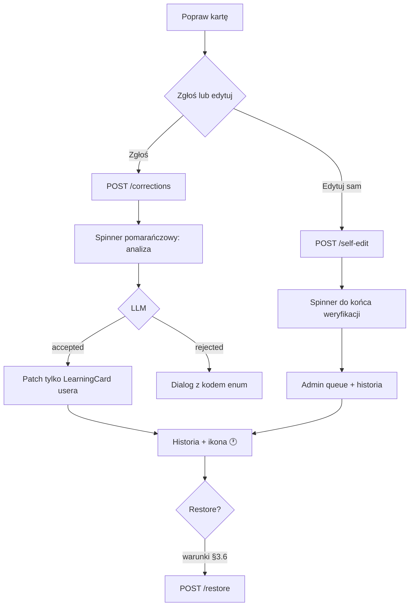

# Feature: Poprawki karty v2 — historia, spinnery, edycja własna z weryfikacją AI

**Status:** zaimplementowano (2026-08-05)  
**Data:** 2026-08-05  
**Powiązane:** `docs/plan-2026-08-04.md` §4, `CardCorrectionFlow.kt`, `card_corrections.py`

---

## 1. Cel produktowy

Użytkownik może:

1. **Zgłosić problem** na karcie → system (AI) analizuje i ewentualnie naprawia treść.
2. **Edytować kartę samodzielnie** (bez zgłoszenia) → zmiana zapisana u usera, weryfikacja AI w tle, wpis dla admina.
3. **Zobaczyć historię** zmian z poziomu kafelka na liście — **bez chipów** statusu.
4. **Przywrócić oryginalną wersję** karty z historii — tylko w określonych warunkach (§3.6).

Doświadczenie podczas oczekiwania: spinner na kafelku + tekst statusu (jak przy tworzeniu karty). W Practice **ten sam wzorzec, kolor pomarańczowy** zamiast niebieskiego (enrichment).

---

## 2. Stan obecny (as-is)

### Backend

| Element | Stan |
|--------|------|
| `card_corrections` | Zgłoszenia: sections, note, status, reason, patch, daty |
| `POST /cards/{id}/corrections` | Zapis + background `process_correction()` → LLM |
| `GET /cards/{id}/corrections/latest` | Ostatnie zgłoszenie (polling) |
| `POST /cards/{id}/self-edit` | Synchroniczna zmiana, bez LLM, bez logu historii |
| `LearningCard.content_review_status` | Pole wewnętrzne (patrz §5.1) |
| `LexicalEntry` + `LearningCard.lexical_entry_id` | Współdzielony cache enrichmentu między userami |
| Admin | Brak |

### Android

| Element | Stan |
|--------|------|
| Ikona „Popraw kartę” | Lista (expand) + Practice |
| `CardCorrectionReportSheet` | Zgłoszenie |
| `CardCorrectionResultDialog` | Wynik accepted/rejected |
| `CardSelfEditSheet` | Edycja — głównie po reject |
| `ContentReviewStatusChip` | Zdefiniowany, **nieużywany** |
| Spinner na kafelku | Tylko enrichment (`pending`) |
| Historia / restore | Brak |

### Współdzielenie treści między userami (P3 — potwierdzone w kodzie)

Architektura **już realizuje** wymaganie izolacji:

1. Przy enrichment nowego słowa `_resolve_content()` szuka gotowego `LexicalEntry` dla pary językowej — jeśli jest, **kopiuje** `content` do `LearningCard` usera i ustawia `lexical_entry_id`.
2. Każdy user ma **własny** rekord `LearningCard` z własnym polem `content`.
3. Przy **accepted correction** i **self-edit** backend ustawia `card.lexical_entry_id = None` i modyfikuje **tylko** `LearningCard.content` tego usera — **nie** aktualizuje `LexicalEntry`.
4. Inni userzy nadal widzą wersję ze współdzielonego wpisu słownika.

**Copy dla usera:** nie „duplikat na liście”, tylko *„Twoja prywatna wersja karty — inni użytkownicy nadal widzą oryginał”*.

**Do dopilnowania w implementacji:** żadna ścieżka (correction, self-edit, restore) nie może robić `UPDATE lexical_entries` na podstawie edycji usera.

---

## 3. Docelowe UX

### 3.1 Kafelek słowa na liście

```
┌─────────────────────────────────────────────┐
│ hablar          [v.]        [🟠 spinner]    │  ← correction / self-edit processing
│ Analizuję zgłoszenie…                       │
├─────────────────────────────────────────────┤
│ (treść karty)                               │
│ ─────────────────────────────────────────── │
│ [🗑] [↗] [✏️ popraw] [🕐 historia]          │
└─────────────────────────────────────────────┘
```

**Reguły widoczności:**

| Element | Kiedy widoczny |
|--------|----------------|
| Spinner + tekst | Karta w stanie `card_activity_status` = `correction_processing` lub `self_edit_processing` |
| Ikona „Popraw kartę” | Rozwinięty kafelek, online, karta nie w enrichment pending |
| Ikona „Historia” (🕐) | `has_content_changes == true` — treść karty **faktycznie się zmieniła** (AI accepted **lub** user self-edit) |

**Brak chipów** statusu na kafelku.

**Kolory spinnera:**

| Kontekst | Kolor |
|----------|-------|
| Enrichment (tworzenie karty) | Primary (niebieski) — bez zmian |
| Correction / self-edit processing | **Orange / tertiary** — lista + Practice |

### 3.2 Modal wejściowy — „Popraw kartę”

**Tytuł:** „Sprawdź i napraw kartę”

**Podtytuł:** „Wybierz sekcje z błędem i opisz problem. System zweryfikuje zgłoszenie i poprawi kartę, jeśli to uzasadnione.”

**Sekcje:** chips z **mniejszymi paddingami** (spacing 4.dp).

**CTA:** „Wyślij do weryfikacji”

**Pod CTA — tekst + link do self-edit:**

> Wolisz poprawić kartę samodzielnie?  
> [Edytuj na własną odpowiedzialność →]  
> Twoja wersja zostanie zapisana tylko u Ciebie. Inni użytkownicy nadal widzą oryginał. Zmiana trafi też do weryfikacji w tle.

Self-edit dostępny **bez** wcześniejszego zgłoszenia i **bez** czekania na reject.

### 3.3 Wynik zgłoszenia (P5)

**Dialog zostaje** dla rejected (i opcjonalnie accepted) — ale:

- API zwraca **`rejection_code`** / **`result_code`** z enuma (nie surowy tekst LLM jako główny komunikat).
- UI mapuje kod → **standardowy string** z `strings.xml`.
- Surowy `reason` z LLM trafia do **historii** (sekcja „szczegóły”) i tabeli admina — nie jako jedyny komunikat dla usera.

Przykładowe kody:

| Kod | Komunikat UI (PL) |
|-----|-------------------|
| `correction_accepted` | Zgłoszenie uznane — kartę zaktualizowano. |
| `correction_unfounded` | Nie znaleźliśmy błędu w wskazanych sekcjach. |
| `correction_insufficient_info` | Opis był zbyt ogólny — spróbuj doprecyzować. |
| `correction_not_applicable` | Ta sekcja nie dotyczy tego typu słowa. |
| `correction_processing_failed` | Nie udało się przetworzyć zgłoszenia. Spróbuj ponownie. |

LLM w promptcie: zwracać `code` + opcjonalny `reason_detail` (dla admina/historii).

### 3.4 Self-edit

Po „Zapisz”:

1. Zamknięcie sheeta.
2. Kafelek w stanie `self_edit_processing` — **pomarańczowy spinner** do końca całego pipeline (zapis + weryfikacja AI).
3. Treść zapisana w DB od razu (P1), ale UI odzwierciedla faktyczny stan przetwarzania (P6).
4. Po zakończeniu: normalny kafelek, ikona historii widoczna.

### 3.5 Modal historii

Timeline (od najnowszego). Wpisy:

- zgłoszenie usera (informacyjnie, bez ikony historii sama w sobie),
- zmiana przez AI (accepted),
- edycja własna usera,
- ewentualnie wpis „przywrócono oryginał”.

Ikona 🕐 na kafelku pojawia się dopiero po **realnej zmianie treści** (nie po samym zgłoszeniu w toku ani po samym reject bez edycji).

### 3.6 Przywracanie oryginału (P4)

W historii — akcja **„Przywróć oryginalną wersję”** tylko gdy:

| Scenariusz | Restore? |
|------------|----------|
| User edytował sam, **bez** wcześniejszego reportu | ✅ Tak |
| User zgłosił report → API **odrzuciło** → user edytował sam | ✅ Tak |
| User zgłosił report → API **zaakceptowało** i zmieniło kartę | ❌ Nie |
| User edytował po zaakceptowanym reportcie AI | ❌ Nie (na MVP) |

**Co jest „oryginałem”:**

- Snapshot `content` + lemma/pos/gloss **z momentu przed pierwszą edycją usera** w danym łańcuchu.
- Przy odłączeniu od `LexicalEntry` (`lexical_entry_id → null`) zapisać `pre_edit_snapshot` w evencie historii.
- Restore: `POST /cards/{id}/restore` z `history_event_id` → przywraca snapshot, ponownie `lexical_entry_id` jeśli był (opcjonalnie), wpis `restored_to_original` w historii.

Wymaga online.

---

## 4. Flow użytkownika



---

## 5. Model danych i API

### 5.1 Pola na `LearningCard` (response)

```text
card_activity_status: null | "correction_processing" | "self_edit_processing"
has_content_changes: bool     # ikona historii
```

**`content_review_status` (P10 — wyjaśnienie):**

To **wewnętrzne pole** w bazie (`correction_reported`, `user_edited` itd.) używane dziś przez backend i sync. **User go nie widzi** i nie potrzebuje go w UI. W v2:

- **Zostawiamy w DB/sync** — backend może z niego derivować `card_activity_status`.
- **Android nie pokazuje chipów** ani nie polega na tym polu w UI.
- Nowe flagi (`has_content_changes`, `card_activity_status`) są tym, co UI faktycznie używa.

Nie trzeba nic „rozumieć” po stronie produktu — to szczegół implementacyjny migracji.

### 5.2 Tabela `card_history_events`

| Kolumna | Typ | Opis |
|---------|-----|------|
| id | UUID | PK |
| card_id | UUID | FK |
| user_id | UUID | FK |
| event_type | string | patrz poniżej |
| actor | string | `user` \| `system` |
| result_code | string? | enum dla UI (P5) |
| summary | text | Gotowy tekst dla timeline |
| payload | JSONB | sections, note, patch, before/after, `pre_edit_snapshot` |
| created_at | timestamptz | |

**event_type:** `correction_submitted`, `correction_accepted`, `correction_rejected`, `self_edit_applied`, `self_edit_reviewed`, `restored_to_original`

### 5.3 Tabela `admin_card_reviews`

Jak w v1 — **tylko tabela DB**, bez panelu (P8). Admin panel później.

### 5.4 Endpointy

| Metoda | Ścieżka | Opis |
|--------|---------|------|
| GET | `/cards/{id}/history` | Timeline |
| POST | `/cards/{id}/corrections` | + event; bez rate limitu (P7) |
| POST | `/cards/{id}/self-edit` | Zapis + background `review_self_edit()` |
| POST | `/cards/{id}/restore` | Przywrócenie snapshotu (§3.6) |
| GET | `/cards/{id}/corrections/latest` | Polling statusu |

### 5.5 Job `review_self_edit`

- LLM ocenia sensowność edycji.
- Wynik → `admin_card_reviews` (`ai_verdict`, `ai_reason`).
- **Tylko flaga dla admina** — user zostaje z własną wersją (P2).
- Po zakończeniu: `card_activity_status = null`.

### 5.6 Rate limit (P7)

**Usunąć** limit 20 zgłoszeń/dzień. Self-edit też bez limitu.

---

## 6. Android — zakres zmian

| Obszar | Zmiana |
|--------|--------|
| `ListWordTile` | Pomarańczowy spinner + status text; ikona historii |
| `PracticeScreen` | Parzystość; **pomarańczowy** spinner (P9) |
| `CardCorrectionFlow.kt` | Modal, historia, restore, dialog z kodami enum |
| `HomeViewModel` / `PracticeViewModel` | Polling `card_activity_status` |
| Mapowanie kodów API → `strings.xml` | P5 |

---

## 7. Fazy implementacji

### Faza 1 — UX + spinnery + modal
- Przebudowa modala zgłoszenia
- Pomarańczowy spinner (lista + practice)
- Dialog wyniku z enum codes
- Usunięcie `ContentReviewStatusChip`

### Faza 2 — Historia + restore
- `card_history_events` + snapshots
- `GET /history`, `POST /restore`
- `CardHistorySheet` + ikona 🕐 (`has_content_changes`)

### Faza 3 — Self-edit review + admin tabela
- `review_self_edit` job
- `admin_card_reviews`
- Spinner do końca weryfikacji (P6)

### Faza 4 (później)
- Panel admina
- Offline cache historii

---

## 8. Decyzje produktowe (zamknięte)

| # | Decyzja |
|---|---------|
| **P1** | Self-edit: zapis natychmiastowy w DB, weryfikacja AI w tle |
| **P2** | LLM invalid → tylko flaga admina, bez cofania userowi |
| **P3** | Izolacja: zmiana tylko na `LearningCard` usera; `LexicalEntry` nietknięty; inni userzy bez zmian |
| **P4** | Ikona historii tylko po realnej zmianie treści; restore wg §3.6 |
| **P5** | Dialog z kodami enum; LLM reason tylko w szczegółach/historii |
| **P6** | Spinner do końca edycji + weryfikacji (stan faktyczny) |
| **P7** | Brak rate limitu (zgłoszenia i self-edit) |
| **P8** | Admin: tylko tabela DB na teraz |
| **P9** | Practice = Home, spinner **pomarańczowy** |
| **P10** | `content_review_status` zostaje wewnętrznie w backend/sync; UI używa nowych flag |

---

## 9. Copy PL (i18n)

| Klucz | Tekst |
|-------|-------|
| `correction_report_title` | Sprawdź i napraw kartę |
| `correction_report_subtitle` | Wybierz sekcje z błędem i opisz problem. System zweryfikuje zgłoszenie i poprawi kartę, jeśli to uzasadnione. |
| `correction_submit` | Wyślij do weryfikacji |
| `correction_self_edit_link` | Wolisz poprawić samodzielnie? Edytuj na własną odpowiedzialność. |
| `correction_self_edit_hint` | Twoja wersja zostanie zapisana tylko u Ciebie. Inni użytkownicy nadal widzą oryginał. |
| `correction_processing` | Analizuję zgłoszenie… |
| `self_edit_processing` | Zapisuję i weryfikuję Twoją edycję… |
| `card_history_title` | Historia karty |
| `card_history_restore` | Przywróć oryginalną wersję |
| `card_history_restored` | Przywrócono oryginalną wersję karty |
| `cd_card_history` | Historia karty |

---

## 10. Kryteria akceptacji

- [ ] Brak chipów statusu poprawki na kafelku
- [ ] Pomarańczowy spinner podczas correction/self-edit (lista + practice)
- [ ] Spinner trwa do faktycznego końca przetwarzania (P6)
- [ ] Edycja usera nie zmienia kart innych userów / `LexicalEntry`
- [ ] Ikona historii tylko po realnej zmianie treści
- [ ] Restore tylko w scenariuszach §3.6
- [ ] Komunikaty rejected z enum, nie losowy tekst OpenAI
- [ ] Self-edit z modala wejściowego bez wcześniejszego reportu
- [ ] `admin_card_reviews` zapisuje self-edity (tabela only)
- [ ] Brak rate limitu zgłoszeń

---

## 11. Pliki referencyjne

| Obszar | Plik |
|--------|------|
| Izolacja edycji | `backend/app/services/card_corrections.py` (`lexical_entry_id = None`) |
| Współdzielony enrichment | `backend/app/services/card_jobs.py` (`_resolve_content`) |
| UI flow | `android/.../ui/card/CardCorrectionFlow.kt` |
| Lista | `android/.../ui/home/HomeScreen.kt` |

---

*Spec gotowy do implementacji.*
